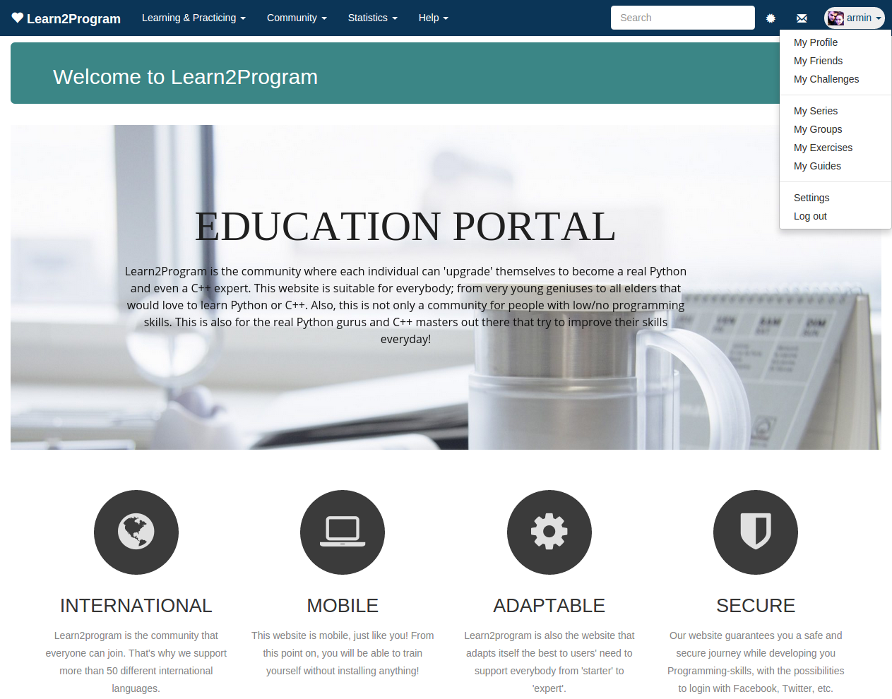

# Learn2Program

A website that will help people lean to program.
Learn2program was made as part of a [programming project databases](https://www.uantwerpen.be/popup/opleidingsonderdeel.aspx?catalognr=1002WETDAT&taal=en&aj=2014) course at the University of Antwerp. 
Learn2program was written using PHP, [Laravel](http://laravel.com/), HTML5, CSS3 and JavaScript.

## Installation
#### Required packages

- mysql-server
- composer
- mcrypt
- php5-cli
- php5-curl
- php5-mysql
- php5-mcrypt

#### Install

Enable mcrypt
~~~
$ sudo php5enmod mcrypt
~~~

Install the php dependencies  (sudo rights may be required)

~~~sh
$ cd htdocs/
$ composer update
$ composer install
~~~

Run the install script

~~~sh
$ cd install/
$ ./install.sh -all   (or -init or -seed)
~~~
This will initialize the database and seed it with some default entries.

#### Run

~~~sh
$ cd htdocs/
$ php artisan serve
~~~

The website is now accessible at http://localhost:8000/

#####Optional: Custom URL & port
Add the following entry to /etc/hosts
~~~
127.0.0.1		learn2program.dev	www.learn2program.dev
~~~
Then run
~~~sh
$ sudo php artisan serve --host=learn2program.dev --port=80
~~~

##Routes
To see the list of routes
~~~sh
$ php artisan route:list
~~~
Run php artisan for more interesting commands.

## Authors
[Armin Halilovic](https://github.com/arminnh)  
[Bruno de Deken](https://github.com/brunodd)  
Raphael Assa
[Fouad Kichauat](https://github.com/Fouad-Kichauat)  
